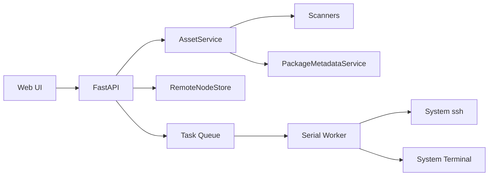

# WSL Ops Panel 分类重构与跨设备同步设计

日期：2026-06-21

## 目标

本次只落地第一批可用能力，避免把 Agent 同步一次写成不可维护的大功能。

要完成：

1. 取消独立 `systemd` 分类。
2. 将 `WSL Ops Panel` 作为 `Project` 资产展示。
3. 为 Node / Python 资产补充包简介、主页、仓库、来源链接。
4. 新增 `SSH 与配置同步` 分类入口。
5. 先实现 SSH 节点中心的本地管理、连接测试和只读扫描骨架。
6. 为后续 Node / Python / Agent 跨设备安装、更新、配置同步留下清晰接口。

暂不完成：

- 不直接同步 Agent 配置到远程设备。
- 不自动改远程 `.zshrc`、`config.toml`、MCP 或 Skill。
- 不把 Docker / Project 的 CF、微信通知能力套到 Node / Python / Agent。

## 分类结构

最终导航分类：

- Docker：容器项目。
- Project：文件系统项目与带运行单元的本机项目，例如 `WSL Ops Panel`。
- Node：npm 全局包和后续远程 Node 包管理。
- Python：pip 包和后续远程 Python 环境管理。
- Agent：Codex、Claude Code、Gemini CLI、OpenCode、OpenClaw、Hermes、Augment 的插件、Skill、MCP、提示词、配置入口。
- Host：端口和本机进程。
- System：系统基础设施。
- SSH 与配置同步：节点中心和配置同步中心。

`systemd` 取消独立分类。systemd 仍作为 Project / Host 的运行能力来源。

## Node / Python 包简介

新增 `PackageMetadataService`：

- npm：读取 npm registry / `npm view --json` 里的 `description`、`homepage`、`repository`、`keywords`、`license`。
- Python：读取 PyPI JSON 里的 `summary`、`home_page`、`project_urls`、`license`。
- 结果写入 `metadata.package_info`。
- 失败不阻塞页面，写入 `metadata.package_info.status=error`。
- 加内存 TTL 缓存，避免列表页反复联网导致卡顿。

详情页展示：

- 简介。
- 来源链接。
- 仓库地址。
- 包管理器。
- 当前版本、最新版本、历史版本。
- 管理状态和支持动作。

## SSH 与配置同步

新增分类 `remote`，显示名 `SSH 与配置同步`。

分类内先放两类资产：

1. `节点中心`
2. `配置同步中心`

第一批实现节点中心。

节点模型：

- id
- name
- host
- port
- username
- auth_type：password / key
- password：第一批允许本地保存，后续再加密迁移
- key_path
- os_hint：auto / linux / macos / wsl / windows
- tags
- status
- last_checked_at
- last_error

节点中心能力：

- 新增节点。
- 编辑节点。
- 删除节点。
- 测试 SSH 连接。
- 只读扫描远程系统基础信息。
- 后续作为 Node / Python / Agent 远程任务目标。

SSH 执行规则：

- 第一批用系统 `ssh` 命令，不引入重型依赖。
- 密码登录可优先检测 `sshpass`，没有则返回明确错误。
- Key 登录直接走 `ssh -i`。
- 命令统一设置超时、ServerAliveInterval、BatchMode。
- 所有远程动作进入任务队列并输出到系统终端日志。

## 配置同步中心

第一批只做入口和结构说明，不直接写远程配置。

后续支持配置项：

- Shell：`.zshrc`、`.bashrc`。
- Git：`.gitconfig`。
- 代理：HTTP_PROXY、HTTPS_PROXY、ALL_PROXY、npm/pip 代理。
- SSH：`~/.ssh/config`。
- Node：`.npmrc`、pnpm、bun 配置。
- Python：pip、uv、conda 配置。
- Agent：AGENTS.md、CLAUDE.md、GEMINI.md、MCP、Skills。

所有写入型同步必须有 dry-run、差异预览、自动备份、应用、验证、回滚入口。

## Agent 方向

参考 `cc-switch` 的模型：

- 客户端维度：Claude Code、Codex、Gemini、OpenCode、OpenClaw、Hermes。
- 工具维度：MCP、Skills、Prompts、Providers、配置文件。
- 写入时保持客户端适配器隔离。
- 配置写入前做备份和原子写入。

WSL Ops Panel 比 `cc-switch` 多一层远程设备，所以第一批只做 Agent 分类结构和路径约定，不做同步写入。

## 数据流

## 测试范围

- 分类加载不再显示 `systemd`。
- `WSL Ops Panel` 出现在 Project。
- Node / Python 资产能展示包简介，失败时页面不崩。
- SSH 节点可新增、列表、删除、测试连接失败时有明确错误。
- 远程分类页面正常打开。
- 既有 Docker / Project 测试不回退。

## 实施顺序

1. 分类重构。
2. WSL Ops Panel Project 注册。
3. Node / Python package metadata service。
4. 详情页展示 package info。
5. remote 分类、模型、存储、API、页面。
6. SSH 连接测试任务。
7. 测试和服务重启验证。
